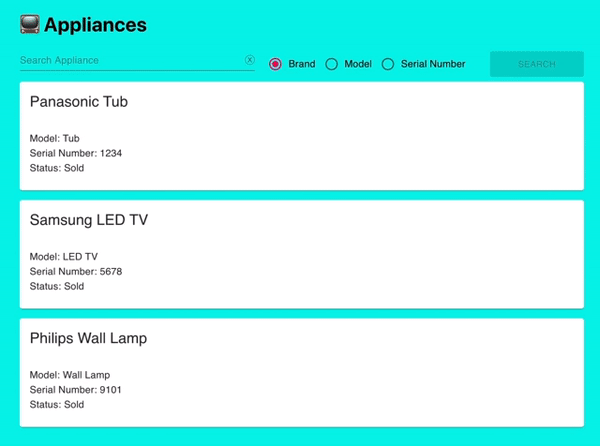

# Golang API Fiber
> REST API using golang fiber with React on frontend

## Demo
https://tuxrace.github.io/golang-api-fiber/.



## Install
```bash
   npm install
   npm run start:dev
```
This will run both `front end` and `back end`

## API
| Method   |      API               |
|----------|------------------------|
| GET      |  /api/appliances`      |
| GET      |    /api/appliances/1   |
| POST     | /api/appliances        |
| DELETE   | /api/appliances/1      |
| GET      | /api/appliances-search?category=model&search=Tub |

## API Usage

### Get all records
```CURL /api/v1/appliances```

### Add a record
```CURL -X POST -H /api/appliances --data "{\"serial_number\": \"1111\", \"brand\": \"Mayer\", \"model\": \"Gas Range\"}" /api/v1/appliances```

### Get a record
```CURL /api/v1/appliances/1```

### Delete a record
```CURL -X DELETE /api/v1/appliances/1```